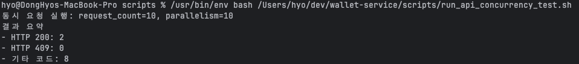
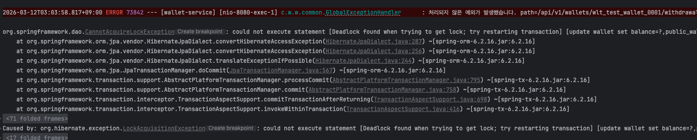
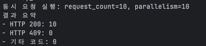

# wallet-service

## 1. 프로젝트 개요

이 프로젝트는 출금 도메인에서 다음을 검증하기 위한 과제 구현입니다.

- `transaction_id` 기반 멱등성 보장(동일 요청 재시도 시 동일 결과)
- 동시성 환경에서 잔액 무결성 보장(잔액 음수 방지)
- 거래내역 조회 API

## 2. 기술 스택

- Spring Boot `3.5.11`
- Java `21.0.10`
- Kotlin `2.3.10`
- MySQL `8.4`
- Spring Data JPA, Flyway, Testcontainers

## 3. 실행 가이드

### 3.1 사전 준비

- Docker (Docker Desktop or OrbStack)

> 로컬 Java 버전 차이 방지를 위해, 실행 가이드는 애플리케이션 또한 컨테이너 방식으로 제공합니다.

### 3.2 인프라 실행 방법

```bash
docker compose up -d --build
```

- MySQL 컨테이너: `wallet-mysql`
- API 컨테이너: `wallet-app`
- MySQL 포트: `3306`
- API 포트: `8080`

#### 3.2.1 정리

```bash
docker compose down -v
```

#### 3.2.2. health 체크


```bash
curl -sS -X GET "http://localhost:8080/actuator/health"
```

### 3.3. 로컬 테스트코드 실행

로컬 테스트 실행 (Gradle/JDK 필요)

```bash
./gradlew test
```

## 4. DB 세팅

### 4.1. 자동 세팅

애플리케이션 시작 시 Flyway가 자동으로 마이그레이션을 수행합니다.

- `/Users/hyo/dev/wallet-service/src/main/resources/db/migration/V1__init_wallet_schema.sql`
- `/Users/hyo/dev/wallet-service/src/main/resources/db/migration/V2__seed_test_wallets.sql`

테이블 및 테스트용 데이터를 자동으로 생성/삽입합니다.

### 4.2. 핵심 스키마

- `wallet`
  - `public_wallet_id` UNIQUE
  - `balance DECIMAL(19,4)` + `CHECK (balance >= 0)`
- `wallet_transaction`
  - `transaction_id` UNIQUE
  - `transaction_type` (`DEPOSIT`, `WITHDRAW`)  
  - `status` (`PROCESSING`, `SUCCESS`, `FAILED`)
  - 상태/완료 컬럼(`balance_after`, `processed_at`, `error_code`) 일관성 체크 제약

### 4.3. 테스트 데이터

- `wlt_test_wallet_0001` (`1000.0000`)
- `wlt_test_wallet_0002` (`5000.0000`)
- `wlt_test_wallet_0003` (`10000.0000`)
- `wlt_test_wallet_0004` (`27500.0000`)
- `wlt_test_wallet_0005` (`50000.0000`)
- `wlt_test_wallet_0006` (`99999.9999`)
- `wlt_test_wallet_0007` (`150000.0000`)
- `wlt_test_wallet_0008` (`300000.0000`)
- `wlt_test_wallet_0009` (`750000.0000`)
- `wlt_test_wallet_0010` (`1000000.0000`)

## 5. API 호출 테스트 방법 (curl/shell)

요청/응답 JSON은 전역 설정에 따라 `snake_case`입니다.

### 5.1. 스모크 테스트 스크립트

> 간단한 시나리오로 API 정상 동작 여부를 검증하는 스크립트입니다.

```bash
bash /Users/hyo/dev/wallet-service/scripts/run_api_smoke_test.sh
```

#### 출력정보

1. 출금 1회
2. 동일 `transaction_id` 재호출(멱등성 확인)
3. 거래내역 조회

### 5.2. 동시성 API 테스트 스크립트

> 다수의 동시 출금 요청을 보내고 결과를 요약하는 스크립트입니다.  
> 환경변수로 `BASE_URL`, `WALLET_ID`, `REQUEST_COUNT`, `PARALLELISM`, `AMOUNT` 등을 조정할 수 있습니다.

```bash
BASE_URL=http://localhost:8080 WALLET_ID=wlt_test_wallet_0010 REQUEST_COUNT=100 PARALLELISM=20 AMOUNT=10000 bash /Users/hyo/dev/wallet-service/scripts/run_api_concurrency_test.sh
```

#### 출력정보

- HTTP `200`/`409` 건수 요약
- 최근 거래내역 5건 조회 결과

### 5.3. 수동 API 호출

#### 5.3.1. 출금 요청

```bash
curl -sS -X POST "http://localhost:8080/api/v1/wallets/wlt_test_wallet_0010/withdrawals" \
  -H "Content-Type: application/json" \
  -d '{"transaction_id":"txn-manual-1","amount":10000}'
```

#### 5.3.2. 거래내역 조회

```bash
curl -sS "http://localhost:8080/api/v1/wallets/wlt_test_wallet_0010/transactions?limit=5"
```

## 6. 구현 설명

1. `wallet_transaction.transaction_id UNIQUE`
2. 신규 요청 등록 시 `INSERT` 수행
3. 중복 키(`DuplicateKeyException`) 발생 시 기존 거래 조회 후 멱등 응답 재생
4. transaction_id는 동일하고, wallet_id는 다른 경우는 `멱등키_요청불일치` 응답
4. 계좌의 잔액 동시성은 `SELECT ... FOR UPDATE`로 해당 월렛 행 락을 통해 처리

이번 과제는 출금의 정합성을 최우선하는 문제로 판단하여, 동시 출금 시 wallet 행에 `PESSIMISTIC_WRITE` 락을 걸어 직렬화하는 방식을 선택했습니다.  
멱등성은 `wallet_transaction` 의 `transaction_id` UNIQUE로 보장하고, 중복 요청은 기존 거래 결과를 조회하여 반환하는 방식으로 구현했습니다.  
즉, 동시성 제어(락)와 멱등성(유니크 키)을 분리해 각각을 단순하고 효과적으로 처리하는 구조입니다.  

낙관적 락의 경우 경합이 많은 상황에서는 재시도 비용과 지연 편차가 커질 수 있기 때문에, 
출금 도메인에서는 실패-재시도보다 대기-순차처리 방식이 더 예측 가능하고 안정적이라고 판단했습니다.  

비관적 락의 장점으로는, DB 트랜잭션 내에서 락과 멱등성 보장을 함께 처리할 수 있어 구현이 간단하고,  
DB의 ACID 트랜잭션과 제약 조건을 활용하여 일관성을 유지할 수 있다는 점입니다.  
단점으로는, 특정 월렛에 대한 트래픽이 집중될 경우 락 대기가 심해질 수 있으며, 트랜잭션이 길어질수록 처리량이 저하될 수 있다는 점입니다.

현재 테스트 요구사항에서는 대규모 트래픽 혹은 샤딩을 필요로 하는 상황이 없었고, Redis, Kafka 또한 필수 사항은 아니었기에 RDB 락 방식 구현으로도 충분하다고 판단하였습니다.  

추후 서비스가 커지고, 트래픽이 증가하여 성능저하 혹은 데이터베이스를 샤딩하게 되는 상황이 온다면, 레디스를 통한 분산락을 도입하여 디비 부하를 줄일 수 있다 생각합니다.  
레디스를 통한 분산락의 경우 장점은, DB 락보다 가볍고 빠르게 락을 획득할 수 있어, 트랜잭션 대기 시간을 줄일 수 있다는 점입니다.  
단점으로는, 락 획득 실패 시 재시도 로직이 필요하며, 락 해제 실패 시 교착 상태가 발생할 수 있다는 점입니다.

## 7. 테스트 결과

> 동시성 전/후 비교 테스트는, 아래 쉘 호출을 통해 비교하였습니다.

```bash
BASE_URL=http://localhost:8080 WALLET_ID=wlt_test_wallet_0001 REQUEST_COUNT=10 PARALLELISM=10 AMOUNT=100 bash /Users/hyo/dev/wallet-service/scripts/run_api_concurrency_test.sh
```

### @Lock(LockModeType.PESSIMISTIC_WRITE) 제거 버전




### @Lock(LockModeType.PESSIMISTIC_WRITE) 적용 버전



